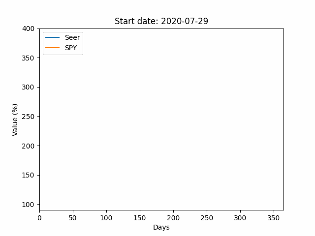

# Seer: AI-Powered Automated Portfolio Management System

  

Seer is an advanced deep learning algorithm for stock forecasting and portfolio design, leveraging the power of BERT and LSTM models for financial analysis and decision-making.

## Features

- **Advanced AI Models**: Utilizes BERT and LSTM in a cutting-edge, multimodal approach for stock forecasting.
- **Live Market Performance**: Achieved near 20% growth in live market paper trading over a one-month period (June 27 - July 27, 2023).
- **Comprehensive Data Integration**: Incorporates timestamped news and financial data retrieved via REST APIs.
- **Automated Trading**: Configured to execute daily trades automatically on a Linux server.
- **Performance Testing**: Includes a simulator for backtesting portfolio performance on historical data.

  

You'll need to run the update dataset functions, along with having valid google newspi, FRED, and yfinance API keys in a .env file. Uses Alpaca as the market maker for placing buy/sell orders for stocks.
